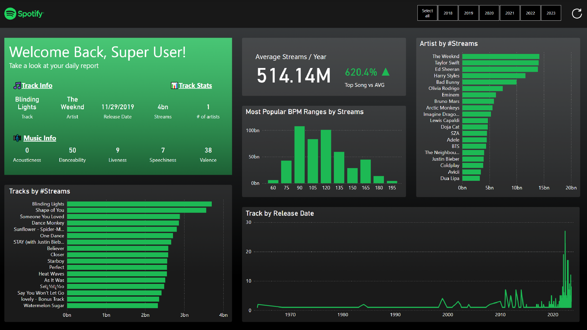

# 🎵 Spotify Power BI Dashboard

This repository contains a Power BI dashboard project that visualizes Spotify streaming data. The dashboard provides insights into track performance, artist popularity, and other key metrics.

## 📊 Project Overview

The Spotify Power BI Dashboard is designed to deliver a comprehensive analysis of music streaming patterns. It allows users to explore top tracks, popular artists, and music attributes through interactive visuals.

### Key Features

- **Track Information**: Displays details of the most streamed track, including:
    - Track name
    - Artist
    - Release date
    - Total streams
- **Music Info**: Insights into track characteristics:
    - Acousticness
    - Danceability
    - Liveness
    - Speechiness
    - Valence
- **Average Streams Per Year**: Shows the average number of streams annually and compares top songs to the average.
- **Most Popular BPM Ranges**: Identifies the tempo ranges that dominate in streaming numbers.
- **Artist by #Streams**: Ranks artists based on their total streams.
- **Tracks by #Streams**: Displays the most streamed tracks.
- **Track by Release Date**: Analyzes the distribution of tracks based on their release years.

## 📷 Dashboard Preview



## 🛠️ Installation & Usage

1. Clone the repository:

    ```bash
    git clone https://github.com/yourusername/spotify-powerbi-dashboard.git
    cd spotify-powerbi-dashboard
    ```

2. Open the Power BI `.pbix` file in **Microsoft Power BI Desktop**.

3. Ensure the required dataset is connected and properly configured.

4. Explore the dashboard by interacting with the visual components.

## 📌 Data Source

This dashboard is built using Spotify streaming data, including track metadata and performance metrics.

## 📈 Technologies Used

- **Power BI**: For data visualization and reporting.
- **DAX (Data Analysis Expressions)**: For creating calculated measures and custom aggregations.
- **Spotify Data**: Data source for music metrics and insights.

## 📄 License

This project is licensed under the [MIT License](LICENSE).

## 🤝 Contributing

Contributions are welcome! Feel free to fork the repository and submit a pull request.

1. Fork the project.
2. Create your feature branch (`git checkout -b feature/new-feature`).
3. Commit your changes (`git commit -m 'Add new feature'`).
4. Push to the branch (`git push origin feature/new-feature`).
5. Open a Pull Request.

## 📧 Contact

For any inquiries, feel free to reach out via [your email] or open an issue in the repository.

